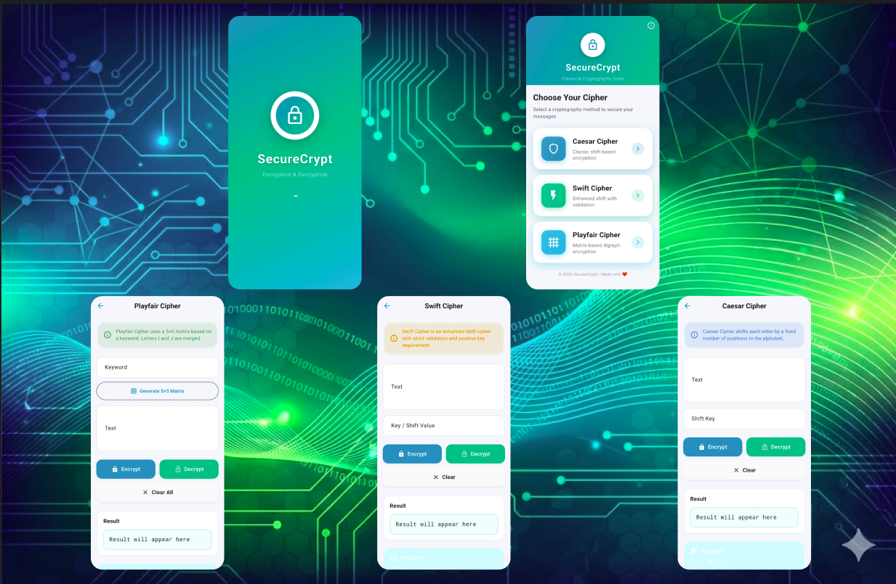

<div align="center">
  
# 🔐 Encryption & Decryption App

### Modern Flutter Application for Classical Cryptography

[](https://flutter.dev/)
[](https://dart.dev/)
[](https://flutter.dev/)

*Cross-platform mobile app for text encryption/decryption using classical ciphers with Material 3 design*

[Features](#-features) • [Screenshots](#-screenshots) • [Installation](#-installation) • [Author](#-author)

</div>

---

## About

A production-ready Flutter application implementing three classical cryptography algorithms with a modern, intuitive interface. Perfect for learning cryptography concepts while experiencing beautiful UI/UX design.

**Key Highlights:**
- 🎓 Educational tool for cryptography concepts
- 🎨 Material 3 design with light/dark themes
- 📱 Cross-platform support (Android, iOS, Web)
- 🔒 100% local encryption - no data leaves your device
- ⚡ Instant results with optimized algorithms

---

## ✨ Features

### 🔑 Three Classical Ciphers

**Caesar Cipher**
- Shift-based substitution with configurable key (positive/negative)
- Preserves case, spaces, and special characters

**Swift Cipher**
- Enhanced shift cipher with bidirectional encryption
- Strict positive key validation

**Playfair Cipher**
- Keyword-based 5×5 matrix encryption
- Visual matrix display with automatic I/J merging
- Handles repeating letters intelligently

### 🎨 UI/UX Highlights

- Material 3 design with light/dark themes
- Copy to clipboard functionality
- Real-time input validation
- Smooth animations and transitions
- Card-based navigation
- Built-in examples and cipher rules

---

## 📸 Screenshots

<div align="center">



*Modern UI showcasing Caesar, Swift, and Playfair Ciphers with Light & Dark themes*

</div>

---

## 🚀 Installation

**Prerequisites:** Flutter SDK 3.10.7+ | [Install Flutter](https://flutter.dev/docs/get-started/install)

```bash
# Clone the repository
git clone https://github.com/Param-vadher/encryption_decryption.git

# Navigate to project
cd encryption_decryption

# Install dependencies
flutter pub get

# Run the app
flutter run
```

**Build for release:**
```bash
flutter build apk --release      # Android
flutter build ios --release      # iOS
flutter build web --release      # Web
```

---

## 📖 Usage

**Caesar Cipher:** Enter text → Set shift key → Encrypt/Decrypt → Copy result

**Swift Cipher:** Enter text → Set positive key → Encrypt/Decrypt → Copy result

**Playfair Cipher:** Enter keyword → Generate matrix → Enter text → Encrypt/Decrypt

**Example:**
```
Text: HELLO | Shift: 3 → KHOOR (Caesar)
Text: Swift Cipher | Key: 5 → Xbnky Hnumjw (Swift)
Keyword: MONARCHY | Text: HELLO → DKQRMN (Playfair)
```

---

## 🛠️ Tech Stack

- **Framework:** Flutter 3.10.7+ | Dart 3.10.7+
- **Design:** Material Design 3
- **State Management:** Provider ^6.1.2
- **Architecture:** Clean architecture with separation of concerns
- **Platforms:** Android, iOS, Web, Windows, macOS, Linux

---

## 📂 Project Structure

```
lib/
├── main.dart              # App entry point
├── ciphers/              # Algorithm implementations
│   ├── caesar_cipher.dart
│   ├── swift_cipher.dart
│   └── playfair_cipher.dart
├── screens/              # UI screens
│   ├── home_screen.dart
│   ├── caesar_screen.dart
│   ├── swift_screen.dart
│   └── playfair_screen.dart
├── widgets/              # Reusable components
└── utils/                # Theme & helpers
```

---

## 🗺️ Future Enhancements

- [ ] More cipher algorithms (Vigenère, Hill, RSA)
- [ ] File encryption/decryption
- [ ] Encryption history
- [ ] Unit tests coverage
- [ ] Multi-language support

See [open issues](https://github.com/Param-vadher/encryption_decryption/issues) for more.

---

## 🤝 Contributing

Contributions are welcome! Follow these steps:

```bash
# Fork the repo → Clone → Create branch
git checkout -b feature/AmazingFeature

# Make changes → Commit → Push
git commit -m "Add AmazingFeature"
git push origin feature/AmazingFeature

# Open a Pull Request on GitHub
```

Please follow Flutter/Dart best practices and update documentation as needed.

---

## 👨‍💻 Author

<div align="center">

### **Param Vadher**

*Flutter Developer | BCA Student | Computer Science Enthusiast*

[](https://github.com/Param-vadher)
[](https://in.linkedin.com/in/param-vadher-b1a9b7333)
[](mailto:paramvadher04@gmail.com)

</div>

### About Me

I'm a passionate Flutter developer and BCA student with a keen interest in cryptography, mobile application development, and creating beautiful, user-friendly interfaces. This project showcases my skills in:

- ✅ Flutter & Dart programming
- ✅ Material Design implementation
- ✅ State management with Provider
- ✅ Algorithm implementation
- ✅ Clean code architecture
- ✅ Cross-platform development

### Connect With Me

- 📧 **Email**: [paramvadher04@gmail.com](mailto:paramvadher04@gmail.com)
- 💼 **LinkedIn**: [linkedin.com/in/param-vadher-b1a9b7333](https://in.linkedin.com/in/param-vadher-b1a9b7333)
- 🐙 **GitHub**: [github.com/Param-vadher](https://github.com/Param-vadher)

### Support My Work

If you found this project helpful, please consider:

- ⭐ Starring the repository
- 🐛 Reporting bugs and issues
- 💡 Suggesting new features
- 🤝 Contributing to the codebase

---

## 🙏 Acknowledgments

Thanks to [Flutter](https://flutter.dev/), [Material Design](https://material.io/), and the open-source community for inspiration and tools.

---

## ⚠️ Disclaimer

This application is designed for **educational purposes** and demonstrates classical cryptography algorithms. The ciphers implemented here are **not suitable for securing sensitive information** in production environments. For real-world security needs, please use modern, industry-standard encryption algorithms (AES, RSA, etc.).

---

<div align="center">

### 🌟 If you like this project, please give it a star! 🌟

**Made with ❤️ using Flutter**

---

**Copyright © 2026 Param Vadher. All rights reserved.**

[⬆ Back to Top](#-encryption--decryption-app)

</div>
